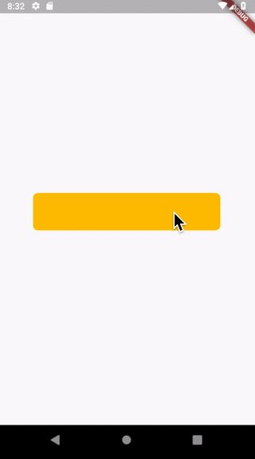

# flare_flutter_button

A sample project to illustrate how to use Flare with Flutter.

## Learn more

If you'd like to learn more, you can read series of blog posts about it:
How to create button animation with Flare in Flutter?
- [Part 1: Create your first animation!](https://medium.com/flutter-community/how-to-create-button-animation-with-flare-in-flutter-part-1-create-your-first-animation-b1c61c81bc1c)
- [Part 2: Animations with TrimPath](https://medium.com/flutter-community/how-to-create-button-animation-with-flare-in-flutter-part-2-animations-with-trimpath-43c8a4e6940f)
- [Part 3: Implement animation in Flutter project](https://medium.com/flutter-community/how-to-create-button-animation-with-flare-in-flutter-part-2-animations-with-trimpath-43c8a4e6940f) 
